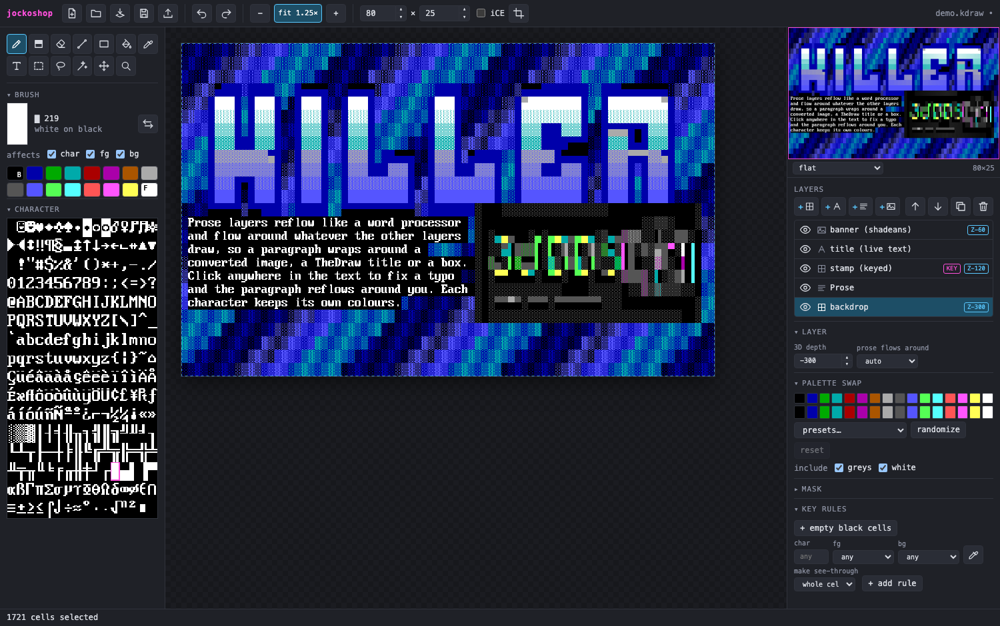
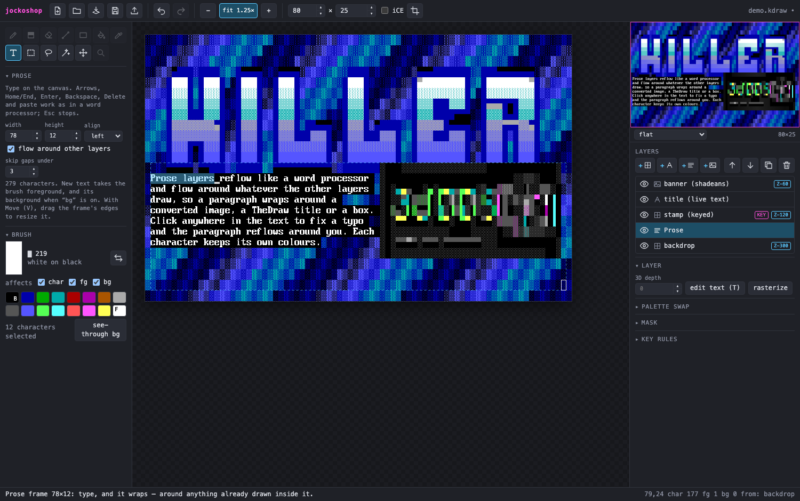
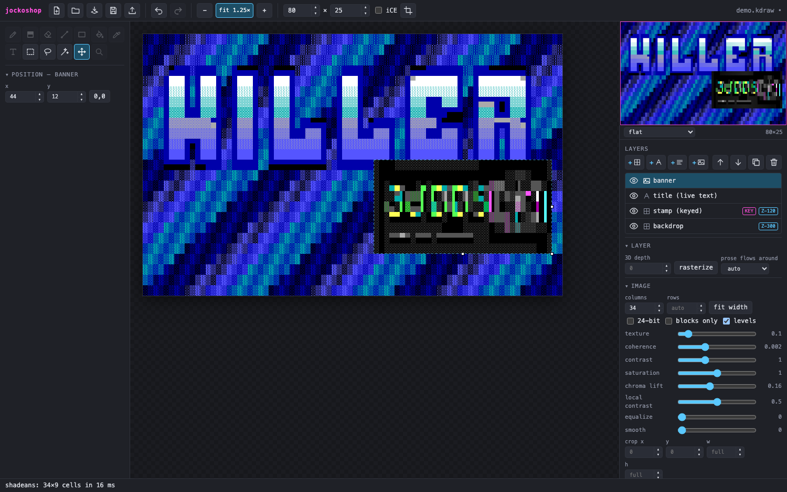
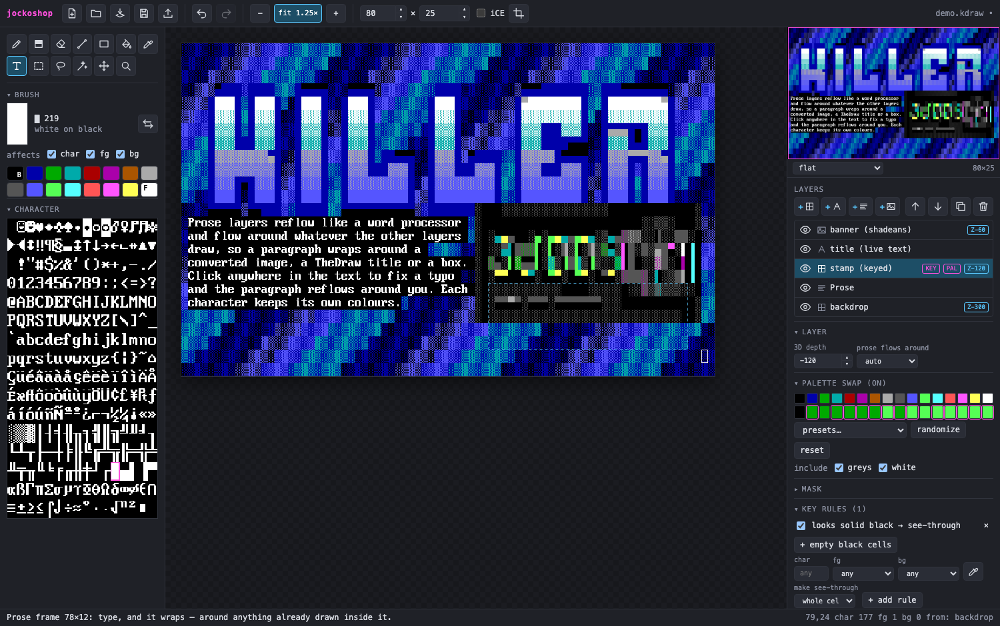
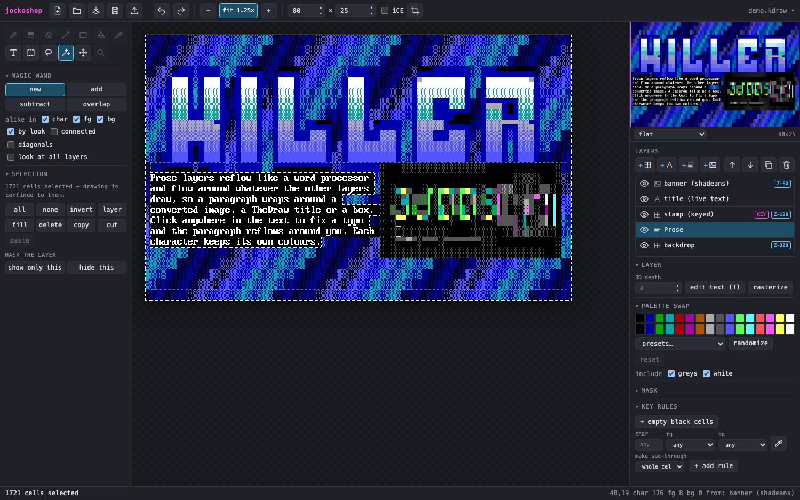
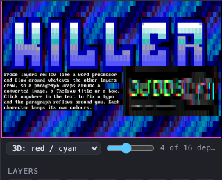

# jockoshop

A layered, non-destructive ANSI art editor. *(Package names inside the repo are still `killerdraw`, the working title.)*

**Downloads:** [Releases](https://github.com/hmderdoc/jockoshop/releases) — macOS (Apple silicon and Intel), Windows and Linux.
The builds are **not code-signed**. On macOS the first launch says "unidentified developer": right-click
`jockoshop.app` → **Open** (or `xattr -d com.apple.quarantine jockoshop.app`). Windows SmartScreen: "More info" → "Run anyway".

The project file keeps the recipe
for a picture (hand-drawn cells, live TheDraw text, source images plus their
conversion settings) and `.ans` is an export. See [DESIGN.md](DESIGN.md).



| | |
|---|---|
|  **Prose** wrapping around a TheDraw title and a converted image; text selected for recolouring |  An **image layer**: shadeans converts it live; every setting is a slider, the original stays in the project |
|  A **palette swap** on the title layer — nothing in the layer changes |  **Magic wand "by look"**: one click takes every cell that shows as flat black |

 The preview in red/cyan: layers at different **3dBBS depths**.

## Run it

```sh
nvm use                 # Node 20 (.nvmrc)
npm install
npm run fonts           # copies TheDraw fonts from a Synchronet install (ctrl/tdfonts) — optional
npm run shadeans        # builds the image converter to WebAssembly — optional, needs Rust + wasm32 target
npm run dev             # http://127.0.0.1:5183   (add ?demo for a small synthetic layered document)
```

The first launch opens **monke.jock**, a six-layer 3D piece, with the preview wiggling so the depth is the
first thing you see; File › New puts the preview back to flat and starts your own document.

`npm run fonts -- /path/to/tdfonts` and `npm run shadeans -- /path/to/shadeans`
point the two optional steps at other locations. Without them the editor still
runs; text layers and image layers say what is missing.

## What works

- **Layers**: cells, live TheDraw text, live images, groups; visibility, reorder, duplicate, move (content pushed off the canvas is kept).
- **Transparency**, four ways, all per layer:
  - per-channel cells (character / foreground / background can each be absent), with exact half-block merging between layers;
  - **key rules** — filter cells by character + colours (or "looks solid black") so lower layers show through, without erasing anything;
  - **masks** — hide part of a layer from a selection, non-destructively; toggle or remove later;
  - or simply select and **Delete** (with the Char / FG / BG switches deciding what is removed — e.g. backgrounds only).
- **Selections**: marquee, lasso, magic wand (alike in char / fg / bg, *by look*, connected or everywhere, this layer or all layers), select by character + colours, all / none / invert / layer content; Shift adds, Alt subtracts, both intersect. Drawing is confined to the selection. Fill, delete, copy, cut; paste lands as a new layer.
- **Palette swap**: remap a layer's 16 colours as it is drawn — presets (hue rotations, all-one-hue, greyscale, swap bright/dark, negative), randomize, or per colour. Works on text and image layers; it is how you recolour a colour TheDraw font.
- **Find & replace** by character + colours, with the same matcher as key rules.
- **Prose layers**: a word processor's text in a frame, not stamped cells. Drag a frame with the Type tool (or “+ prose”) and type; click anywhere in the text to place the caret and fix a typo, and the paragraph reflows. **Flow-around**: whatever other layers already draw inside the frame — a box border, a circle, an image — is an obstacle the text wraps around, so text conforms to odd containers. Select text by dragging, Shift+arrows/Shift+click, double-click a word, or Cmd/Ctrl+A for the whole prose; type over it, Backspace/Delete it, Cmd+C/X/V it, and click a swatch to recolour it (left = foreground, right = background). Arrows, Home/End, Enter, paste; per-character colours; left/centre/right; a typing burst is one undo step. Resize the frame with Move's handles.
- **TheDraw text layers**: 3,474 fonts from Synchronet's set (multi-font files included), font switches mid-string, wrap, spacing; re-editable at any time; rasterize when done.
- **Resize on the canvas**: with Move, an image layer has handles — drag the corner to resize (aspect kept), the right edge for width only, the bottom edge for height only, reconverting as you drag; a text layer's right edge drags its wrap width.
- **Image layers**: [shadeans](https://github.com/hmderdoc/shadeans) compiled to WebAssembly from its unmodified source; resize, crop and adjust from the embedded original at any time; transparent pixels become see-through cells.
- **Canvas**: add or remove rows and columns at any edge — adding at the top or left shifts every layer along; cropping loses nothing.
- **3D (3dBBS)**: a per-layer depth slider — into the screen on the left, the glass at zero, popping out on the right — with a readout of how far apart the two eyes' copies land on the 3DS (past ~26 px the eyes stop fusing it, so the slider stops at 300 in / 60 out); a stereo mode in the preview (wiggle, follow the mouse, red/cyan, side by side) drawn with the device's own disparity formula, and `.ans` export with `CSI = … z` depth tags that other terminals ignore. Depths are the device's centi-world-units: under ~30 is barely visible, 100+ reads clearly, backdrops sit around 300 in. Pop-out goes out as `CSI = Ps ; Pd + z` (3dBBS protocol 0.4; a 0.3 client shows such layers at the glass).
- **F-key character sets**: the TheDraw / PabloDraw / Moebius convention — 16 stock sets, F1–F10 type the set's glyphs at the typewriter caret (or into prose, or into the brush when nothing is being typed), F11/F12 or Ctrl+,/. change set. The set shows as a clickable bar in the footer while the Type tool is active. The Type tool is the **grid typewriter** first: click a cell and type; drag out a frame instead for reflowing prose.
- **Drawing**: one Brush with Moebius's modes — **half block** (the default, `H`: left button paints fg, right bg, two pixels per cell), **character** (`B`, with per-channel switches: recolour only, or draw characters with no background), **shading** (steps cells up ░ ▒ ▓ █, right button back down) and **colorize** (colours only) — plus eraser, line, rectangle, ellipse, fill, pick-up, type; undo/redo for everything. The brush and eraser have a size (`[` and `]`, or the field in the Brush panel): a 3 paints a 3×3 square of cells, or of half blocks.
- **Shapes** are dragged corner to corner (the ellipse fits the box you drag, HERMedIT-style — not Moebius's centre-out drag). The Shape panel picks what the outline is made of — the brush character, half-block pixels (left button foreground, right background, at half-row resolution like the brush), or CP437 single/double box drawing with proper corners (a straight line becomes `─`/`│`; diagonals and ellipses keep the character) — and what goes inside: hollow, a flat colour (spaces in the brush colours), or the character. Shift while dragging fills a hollow shape. On a cells layer the shape is painted as cells. On any other layer — or after **Add layer → Shape**, which arms the shape tools — the drag places a **live shape layer** that keeps its line / box / ellipse: drag its handles to reshape it, inside it to move it, outside it to place another; the Shape and Brush panels on the left restyle and recolour the selected shape. Rasterize it (right) when you want cells.
- **Free transform** (Move tool, `V` or Ctrl/Cmd+T): handles around the active layer — a corner or edge scales, inside moves. Live layers keep their recipe (a shape re-renders, a text frame rewraps, an image re-converts); a cells layer's content is lifted, scaled nearest-neighbour and put back, live, as one undo step — and with a selection, only the selected cells move or scale, and the selection follows.
- **Joint — draw with Moebius users** (topbar "joint", Ctrl/Cmd+J): connects to a Moebius collaboration server (`host:8000/path`, nick, group, password) as a full peer. The server holds a flat canvas edited cell by cell; here, "open joint" makes it a document (its cells as the base layer, plus a pinned **joint: others** layer that receives everyone else's edits), and every local change — on any layer, live text, shapes, undo — goes out as the cells it changed in the flattened picture. Other people's cursors show with their nicks; a floating window has the users and chat; iCE, 9px, font, SAUCE and canvas size sync both ways. "Push my document" instead pushes your whole picture into the room. The wire is 16 colours, so 24-bit cells go out as their nearest palette entry. `scripts/joint-server/` holds a copy of the genuine Moebius server (Apache-2.0) for testing and for hosting (`node scripts/joint-server/start.mjs --file piece.ans --port 8000`); `npm run smoke:joint` and `npm run smoke:joint-app` test against it. The address is what Moebius takes: `host:8000` for a stock server, `host:8000/name` if it was started with `--path=name`. From the **https web app** the browser only allows `wss://`, and the Moebius server only speaks plain `ws://`, so put a TLS proxy in front of it — e.g. an nginx server block for `joint.example.org` with `location / { proxy_pass http://127.0.0.1:8000; proxy_http_version 1.1; proxy_set_header Upgrade $http_upgrade; proxy_set_header Connection "upgrade"; }` — and connect to `wss://joint.example.org`; the desktop app connects to `host:8000` directly, as Moebius does.
- **Mirror mode** (X; Shift+X for top/bottom): every stroke is repeated across the canvas centre, with glyphs that have a mirror image swapped (▌↔▐, ┌↔┐, ( ↔ ) …).
- **Reference images**: an image shown over the canvas to draw from, at any size and opacity — never part of the picture or the exports. One click converts it into a real image layer at the same place.
- **Scale a drawn layer** two ways: *cells* stretches the grid (exact at 200%, 300%…) and keeps every character; *re-match* renders it to pixels, scales, and lets shadeans redraw it — its style, not your strokes. Flip horizontal/vertical too.
- **Layer opacity** (opt-in, per layer): below 100% the layer is blended as pixels against what's beneath and its cells are re-matched through shadeans in the flattened picture — the look of translucency, at the cost of those cells being shadeans' choice rather than yours. The layer's own cells never change; 100% brings them back.
- **3dBBS files reopen in 3D**: an exported `.ans` with depth tags opens as one layer per depth plane, each with its depth set.
- **SAUCE editor**: title, author, group, date, comments, font name, 9-px flag.
- **Recent files** (desktop): the clock icon next to Open.
- **Files**: `.jock` project (ZIP: manifest, layer data, masks, original assets, flattened `preview.ans`). Projects saved as `.kdraw` by earlier builds still open.
  **Open** makes a new document from a file; **drop** a file on the window and it is added to the current document as a layer instead (art lands where you dropped it; a dropped `.jock` opens as the document).
  Open / import: ANS (16-colour, iCE, 24-bit), BIN, XBIN, TundraDraw `.tnd`, Synchronet Ctrl-A `.msg`, Artworx `.adf`, iCE Draw `.idf`, Avatar `.avt`, plain text.
  Export: ANS, 3dBBS ANS, BIN, XBIN, TundraDraw, Ctrl-A, text (CP437 or UTF-8), PNG — the same set PabloDraw writes, plus 3dBBS —
  and two pictures of the depth layers: a **3D wiggle** animated PNG (plays anywhere an APNG does — browsers, Discord,
  Mastodon) and a red/cyan anaglyph PNG. The wiggle export opens a dialog that animates exactly what will be saved, with
  the eye separation (100% = the 3DS at full slider, up to 200%), swing or two-frame flip, frame count, speed and 1–3× size.

Not yet: moving/transforming a selection in place (paste-as-layer + Move covers it for now), mesh layers, Windows/Linux builds tried on real machines.

## Web app

The same build runs at [jockoshop.futureland.today](https://jockoshop.futureland.today). `npm run build` writes
`packages/app/dist`, a static site: serve it from any web server (fonts and `shadeans.wasm` are copied in from
`public/`, so run `npm run fonts` and `npm run shadeans` first).

In Chrome and Edge the File System Access API gives the web app files with handles: Open and Save As go through the
system dialog, **Save writes back to the file** (the first save into a file you opened asks once), a dropped `.jock`
can be saved back too, and exports get a Save As dialog rather than landing in Downloads. Safari and Firefox do not
have that API, so there Save is a download of the `.jock` and Open is a file picker, as before.

It is also a PWA: a service worker (`public/sw.js`) caches the page and the fonts you have used, so it works offline
once visited, and the manifest lets Chrome/Edge **install** it as its own window with `.jock` and ANSI file
associations (double-click a file, or "Open with", and it lands in the running editor). Safari on macOS 14+ can add
it to the Dock, without the file associations.

## Desktop app (Tauri)

```sh
npm run desktop          # runs the app in a native window (first build compiles Tauri: a minute or two)
npm run desktop:build    # packages/desktop/src-tauri/target/release/bundle/macos/jockoshop.app (+ .dmg)
```

**Rust must be current stable, installed with [rustup](https://rustup.rs)** — `rustup update stable`, then
`rustc --version`. Tauri's dependency tree tracks recent compilers, so an older toolchain stops the build with a wall of
`<crate> requires rustc 1.88` lines. A distro package (`apt install rustc`) is usually too old and does not update;
if `which rustc` says `/usr/bin/rustc`, install rustup instead and open a new shell. CI builds with whatever stable is.

Build **natively for the platform you want**: a Windows app from PowerShell, not from WSL — WSL builds a Linux binary,
needs Tauri's Linux packages (`libwebkit2gtk-4.1-dev`, `build-essential`, `curl`, `wget`, `file`, `libxdo-dev`,
`libssl-dev`, `libayatana-appindicator3-dev`, `librsvg2-dev`) and a display for `tauri dev`, and compiling on a
`/mnt/c` or `/mnt/d` path is very slow. `npm run desktop:build` is the
macOS packaging step (`.app` + `.dmg`); elsewhere use `npx tauri build` inside `packages/desktop`, which writes the
installer for the host platform, or let the release workflow build all three.

The desktop app is the same web app in a system webview, plus what a
browser can't do: files with paths (Save saves in place, Shift-click / Cmd+Shift+S for Save As), a native menu bar,
`.jock` / `.ans` file associations, drag a file onto the window to add it as a layer (a `.jock` opens), files on the command line,
and an "unsaved changes" prompt on close. Fonts and `shadeans.wasm` are compiled into the binary, so run
`npm run fonts` and `npm run shadeans` before building.

The `.dmg` is made with plain `hdiutil` (`scripts/make-dmg.sh`) rather than Tauri's DMG step, which scripts Finder
to arrange the window and so triggers a macOS "control Finder" permission prompt.

## Finding your way around

- **Left**: the tool palette (icons; hover for the name, shortcut and what it does). The tool decides what is under it —
  drawing tools show the brush, colours and characters; the select tools show selection options and what to do with the
  selection (fill, delete, copy, mask the layer…); **Type** on a text layer shows its font and text; **Move** shows the
  position; **Find** (`S`) shows find & replace.
  The tool follows the layer: select a text layer with a brush active and you get Type (an image layer: Move); go back
  to a cells layer and the brush returns. Move and the select tools carry over. With Move, double-click a text layer
  to edit its text.
- **Right**: an always-on preview of the whole picture — the pink box is what the canvas is showing; click or drag to go
  there, and switch it to a 3D mode to see the layer depths — then the layer stack, then the active layer's own
  properties in collapsible panels (depth, image settings, palette swap, mask, key rules). Panels remember whether you
  left them open.
- **Top**: new, open, import as layer, save, export (a small menu: `.ans`, `.png`, 3dBBS `.ans`, 3D wiggle / anaglyph `.png`), undo/redo, zoom, canvas
  size and iCE.

## Checks

```sh
npm run check           # typecheck + unit tests (core)
npm run smoke           # drives the running editor in headless Chrome with real mouse/keyboard input
npm run smoke:joint     # the Moebius protocol against the genuine server (first: cd scripts/joint-server && npm install)
npm run smoke:joint-app # two headless editors in one joint on that server: draws, undo, chat, cursors, resize, push
```

`npm run smoke` needs `npm run dev` running and a Chrome binary (`CHROME_PATH`, or
one cached by puppeteer under `~/.cache/puppeteer`).

## Layout

```
packages/core           document model, compositor, matcher, undo, TDF, renderer, formats — no DOM
packages/app            the editor (Vite, plain TypeScript)
packages/shadeans-wasm  C-ABI wrapper that compiles shadeans' sources in by path
packages/desktop        Tauri shell: window, native menu, file read/write, open-with, close guard
scripts/                font sync, shadeans build, browser smoke tests
scripts/joint-server/   the Moebius collaboration server (Apache-2.0 copy, see its NOTICE.md): test rig, and `start.mjs` to host a joint
```

## Licence

Apache-2.0 (see `LICENSE`). The image converter is [shadeans](https://github.com/hmderdoc/shadeans), compiled in
from its own source by `packages/shadeans-wasm`; TheDraw fonts are fetched from
[Synchronet](https://github.com/SynchronetBBS/sbbs) at build time and are not part of this repository.
